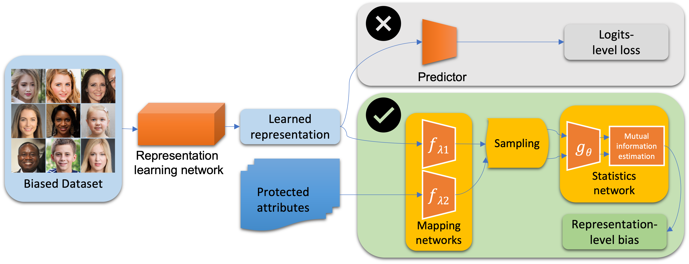

# Representation Level Bias (RLB) Assessment



[Information-Theoretic Bias Assessment Of Learned Representations Of Pretrained Face Recognition](https://arxiv.org/abs/2111.04673)

Jiazhi Li, Wael Abd-Almageed

```
@inproceedings{li2021information,
  title={Information-Theoretic Bias Assessment Of Learned Representations Of Pretrained Face Recognition},
  author={Li, Jiazhi and Abd-Almageed, Wael},
  booktitle={2021 16th IEEE International Conference on Automatic Face and Gesture Recognition (FG 2021)},
  pages={1--8},
  year={2021},
  organization={IEEE}
}
```

## Requirements
```
pip install -r requirements.txt
```

## Experiments
To conduct experiments, run

```
bash run_colored_model.sh
```

After running, the convergence lines shown as `Fig.3(a)` in the paper will be saved in the current directory as `colored_mnist_convergence.png`. The results with each different color standard deviation will be saved in `./result/colored_model/reproduce/`.


